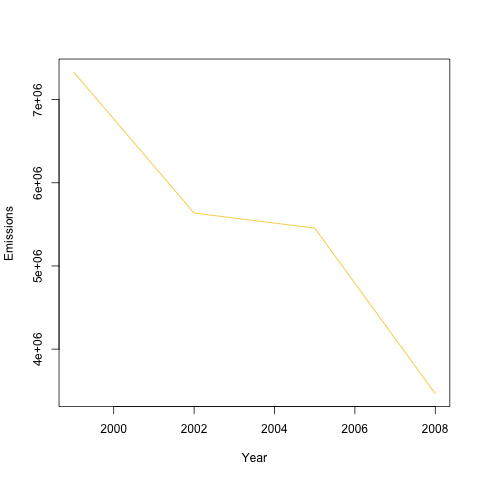
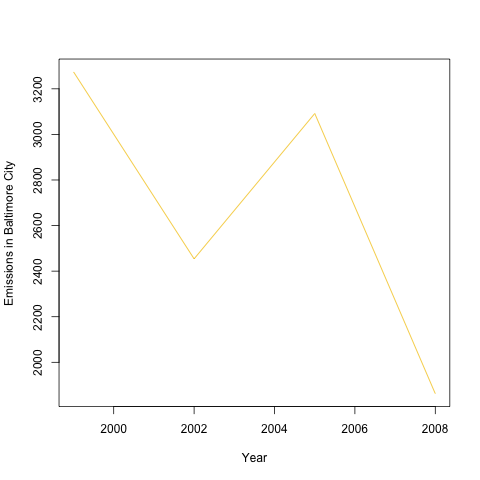
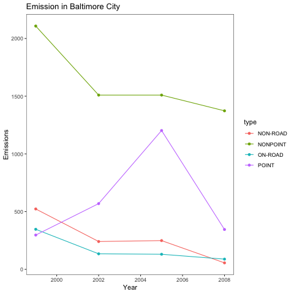
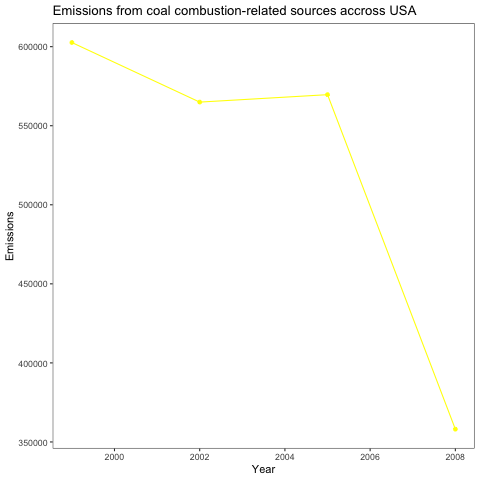

# Exploratory-Data-Analysis-Course-Project-2

The overall goal of this assignment is to explore the National Emissions Inventory database and see what it say about fine particulate matter pollution in the United states over the 10-year period 1999–2008. You may use any R package you want to support your analysis.

## Questions

You must address the following questions and tasks in your exploratory analysis. For each question/task you will need to make a single plot. Unless specified, you can use any plotting system in R to make your plot.


1. Have total emissions from PM2.5 decreased in the United States from 1999 to 2008? Using the base plotting system, make a plot showing the total PM2.5 emission from all sources for each of the years 1999, 2002, 2005, and 2008.

2. Have total emissions from PM2.5 decreased in the Baltimore City, Maryland (\color{red}{\verb|fips == "24510"|}fips == "24510") from 1999 to 2008? Use the base plotting system to make a plot answering this question.

3. Of the four types of sources indicated by the \color{red}{\verb|type|}type (point, nonpoint, onroad, nonroad) variable, which of these four sources have seen decreases in emissions from 1999–2008 for Baltimore City? Which have seen increases in emissions from 1999–2008? Use the ggplot2 plotting system to make a plot answer this question.

4. Across the United States, how have emissions from coal combustion-related sources changed from 1999–2008?

5. How have emissions from motor vehicle sources changed from 1999–2008 in Baltimore City?

6. Compare emissions from motor vehicle sources in Baltimore City with emissions from motor vehicle sources in Los Angeles County, California (\color{red}{\verb|fips == "06037"|}fips == "06037"). Which city has seen greater changes over time in motor vehicle emissions?

## Answers

### 1. Plot1.R

  ``` 
  library(dplyr)

  # Read the two .rds files into memory

  NEI <- readRDS("exdata_data_NEI_data/summarySCC_PM25.rds")
  SCC <- readRDS("exdata_data_NEI_data/Source_Classification_Code.rds")

  # Aggregate data

  NEI.by.Year <- NEI %>% group_by(year) %>% summarise(Emmisions = sum(Emissions))
  # ignoring the warning

  # Addressing question 1 - Have total emissions from PM2.5 decreased in the United 
  # States from 1999 to 2008? Using the base plotting system, make a plot showing 
  # the total PM2.5 emission from all sources for each of the years 1999, 2002, 
  # 2005, and 2008.


  plot(NEI.by.Year$year, NEI.by.Year$Emmisions, type='l', ylab='Emissions', xlab='Year', col = NEI.by.Year$year)
```

  

### 2. Plot2.R

  ```

  library(dplyr)
  
  # Read the two .rds files into memory
  
  NEI <- readRDS("exdata_data_NEI_data/summarySCC_PM25.rds")
  SCC <- readRDS("exdata_data_NEI_data/Source_Classification_Code.rds")
  
  NEI.Maryland <- subset(NEI, fips == "24510")
  
  # Aggregate data
  
  NEI.Maryland.by.Year <- NEI.Maryland %>% group_by(year) %>% summarise(Emmisions = sum(Emissions))
  # ignoring the warning
  
  # Addressing question 2 - Have total emissions from PM2.5 decreased in the 
  # Baltimore City, Maryland (\color{red}{\verb|fips == "24510"|}fips == "24510") 
  # from 1999 to 2008? Use the base plotting system to make a plot answering this 
  # question.
  
  # Define device, set characteristics and plot
  png("plot2.png")
  
  plot(NEI.Maryland.by.Year$year, NEI.Maryland.by.Year$Emmisions, type='l', ylab='Emissions Baltimore City', xlab='Year', col = NEI.Maryland.by.Year$year)
  
  # set the device off and back to the default screen device
  dev.off()
  ```
    
   
### 3. Plot3.R

  ```
    library(dplyr)
    library(ggplot2)
    
    # Read the two .rds files into memory
    
    NEI <- readRDS("exdata_data_NEI_data/summarySCC_PM25.rds")
    SCC <- readRDS("exdata_data_NEI_data/Source_Classification_Code.rds")
    
    NEI.Maryland <- subset(NEI, fips == "24510")
    
    # Aggregate data
    
    NEI.Maryland.by.Year <- NEI.Maryland %>% group_by(year, type) %>% summarise(Emmisions = sum(Emissions))
    
    # ignoring the warning
    
    # Addressing question 3 - Of the four types of sources indicated by the 
    # \color{red}{\verb|type|}type (point, nonpoint, onroad, nonroad) variable, 
    # which of these four sources have seen decreases in emissions from 1999–2008 
    # for Baltimore City? Which have seen increases in emissions from 1999–2008? 
    # Use the ggplot2 plotting system to make a plot answer this question.
    
    # Define device, set characteristics and plot
    png("plot3.png")
    
    ggplot(data = NEI.Maryland.by.Year, aes(x = year, y = Emmisions, col =type)) + xlab("Year") + geom_point() + ylab("Emissions") + geom_line() + theme_bw() +theme(panel.grid.major = element_blank(), panel.grid.minor = element_blank()) + ggtitle("Emission in Baltimore City")
    
    # set the device off and back to the default screen device
    dev.off()
  ```
   

### 4. Plot4.R

  ```
    library(dplyr)
    library(ggplot2)
    
    # Read the two .rds files into memory
    
    NEI <- readRDS("exdata_data_NEI_data/summarySCC_PM25.rds")
    SCC <- readRDS("exdata_data_NEI_data/Source_Classification_Code.rds")
    
    # Merge the tow data frames on column SCC
    NEI.SCC <- merge(NEI, SCC, by="SCC")
    
    # Filter all rows where word Coal/coal/COAL has appeared 
    NEI.SCC.Coal <- NEI.SCC[grepl("Coal|coal|COAL", NEI.SCC$Short.Name),]
    
    # Aggregate data
    
    NEI.SCC.Coal.by.Year <- NEI.SCC.Coal %>% group_by(year) %>% summarise(Emmisions = sum(Emissions))
    
    # ignoring the warning
    
    # Addressing question 4 - Across the United States, how have emissions from coal 
    # combustion-related sources changed from 1999–2008?
    
    # Define device, set characteristics and plot
    png("plot4.png")
    
    ggplot(data = NEI.SCC.Coal.by.Year, aes(x = year, y = Emmisions)) + xlab("Year") + geom_point(col = "yellow") + ylab("Emissions") + geom_line(color = "yellow") + theme_bw() +theme(panel.grid.major = element_blank(), panel.grid.minor = element_blank()) + ggtitle("Emissions from coal combustion-related sources accross USA")
    
    # set the device off and back to the default screen device
    dev.off()
  ```
  